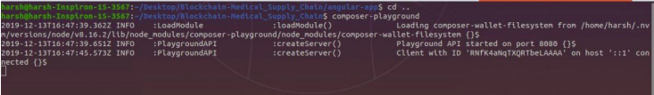
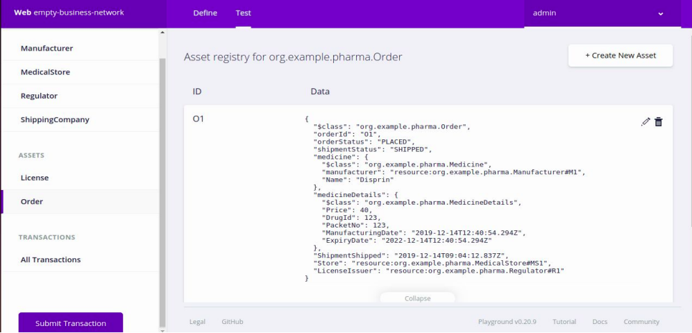
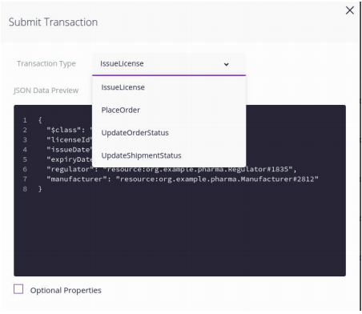
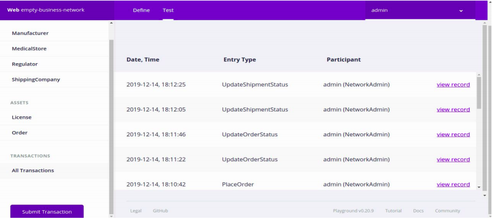
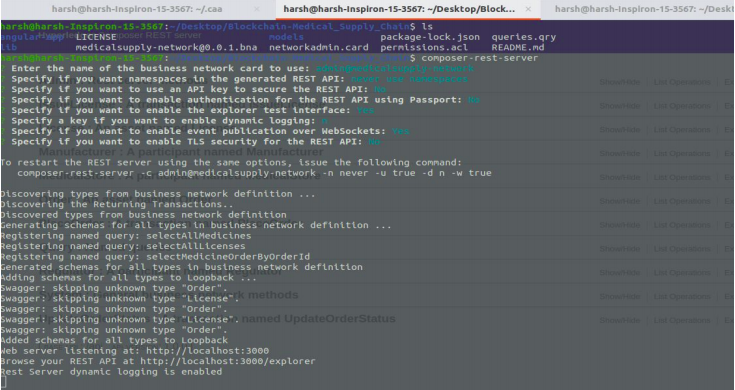
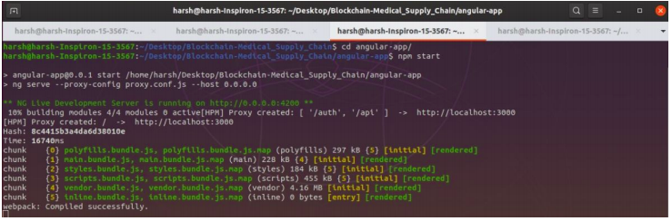
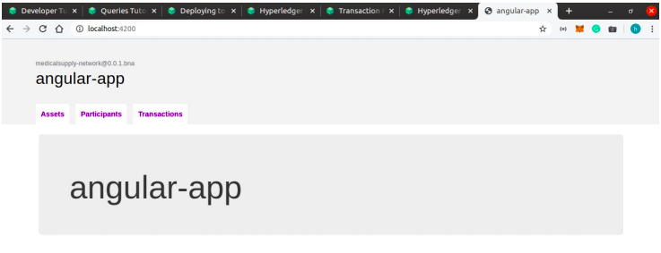
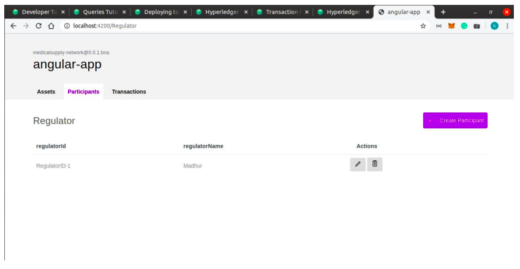

# Blockchain-Medical_Supply_Chain

The basic aim of our project is to design a system for Drug/Medicine Supply Chain Integrity Management using a permissioned blockchain network - Hyperledger Fabric. Using blockchain, ensures immutability and security in our network. In the case of healthcare, the permissionless blockchain network failed to manage the integrity and privacy of data related to patient information, drug management, and medical reports. As the primary goal of healthcare-based solution is to keep medical data secure and transparent, many permissionless healthcare blockchains are designed by applying some additional access control policy to maintain the integrity of data. However, these additional access control policies affect the efficiency of these healthcare systems.

In this project, we have focussed on designing the architecture for a complete supply chain for medicine from it’s a manufacturer to the end consumer i.e. patient in such manner that each medicine has a complete immutable record of its journey from being manufactured to being consumed and that record is just a barcode scan away.

## Introduction

So, now our beginning node is the Regulator. He is the authority that distributes the License to Manufacturer to produce medicines. He can give License to n number of Manufacturers.

Each Manufacturer will produce legitimate medicines and create attributes for them like Medicine ID, Expiry Date and price. Each Manufacturer can ship the medicines with the Shipment Companies of their choice from the network and can sell them to the pharmacies. Now, the use of permissioned blockchain comes into play. If a manufacturer has to sell medicines to two pharmacies - one is a retail pharmacy owner and one is a wholesaler of medicines, due to Economies of scale, a good business model would be to sell the medicines to the wholesaler on a lower price as compared to the retailer.

But, if this would have been a public blockchain network setting different prices for two entities without them knowing was not possible. It can be done only using permissioned or private blockchains. Now after the medicine has been supplied to the pharmacies, patients can go and buy them.

As the system is immutable and transparent, it cuts counterfeits of medicines to zero. Now, all medicines will have a legitimate ID associated to it which stores all the data about it - all the nodes in the supply chain it travelled through, it’s expiry date and price. The proposed system is a proof-of-concept application that keeps track of individual drug records using blockchain technology in a decentralized way.

## Requirements

|Component|Description  |
|--|--|
| IDE | composer-playground |
| Hyperledger Fabric | v1.2 |
| Node | v8.11.4 |
| CLI Tool | Composer Rest Server |
| Docker-Compose Version | 1.13.0 |
| Javascript | 1.8.5 |
| Docker Engine | Version 18.06.1-ce |
| CPU | Intel(R) Core(TM) i5-8500 CPU @ 3.00GHz 3.00 GHz |
| Operating Systems | Ubuntu |
| Linux | 18.04.1 LTS |
| Memory | 8 GB |  

## Workflow

Now, I will begin explaining the complete workflow of the project.
First of all we run the composer-playground -

As the composer-playground starts running we can see our project like this -

The upper left corner has Participants of our network, followed by assets and followed by transactions. In the upper right corner we have an option to create new assets. And in the middle we can see the complete description of our assets like Order1 has OrderID as O1 and is composed of a drug beingmanufactured with DrugID 123 and price 40. It also has other drug details as well as details of shipment.

Now we can do transactions on our asset like Issue License, Place Order, Update Order Status and
Update Shipment Status which can also be done in composer-playground and the screenshot of which
is shown below.

After update, the transaction list will look like this -

Now we will be running composer -rest-server. The project is named medicalsupply-network and it
will host a web application at port 3000 which will provide functionalities like GET and POST for our transactions, assets and participants. The command for it is as follows -

Now, we will be running the angular-app. The command for which is as follows -

The angular-app will run on port 4200 and will give a web application for the functionalities we have discussed before. Following screenshots show how the angular-app will look -

We can perform all the tasks we did on composer-playground on our angular-app just as easily. It is basically for after deployment phase. This is how our end user will use these functionalities.

